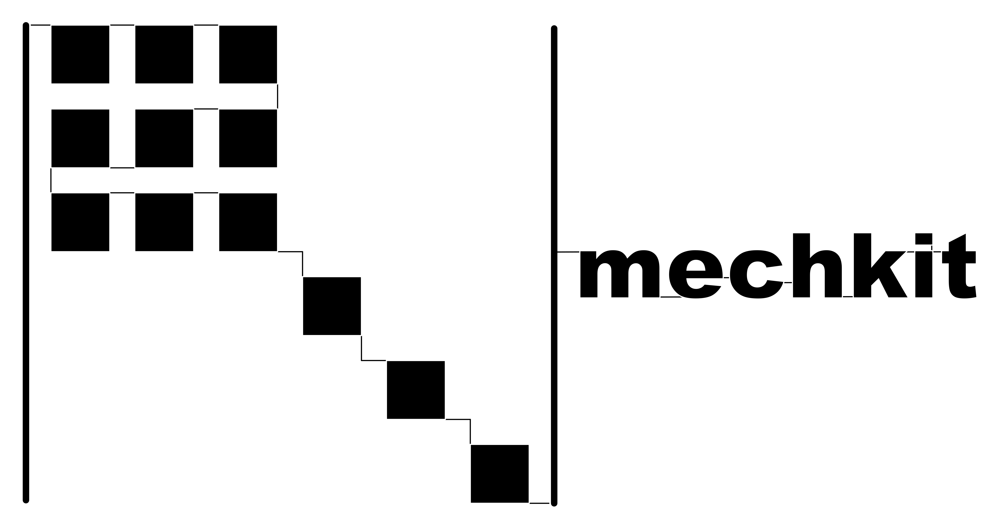

[](https://pypi.org/project/mechkit/)
[][url_latest_doi]
[][url_read_the_docs_latext]
[](https://github.com/psf/black)
[](LICENSE)
[](https://mybinder.org/v2/gh/JulianKarlBauer/mechkit/HEAD)

<p align="center">
  <a href="https://github.com/JulianKarlBauer/mechkit/blob/67f1b61afbcac739a0bf61801a81d9a9028abb56/logo/logo.png">
  
  </a>
</p>

# mechkit

Basic continuum mechanics toolkit.

For more details please refer to [the docs][url_read_the_docs_latext].

Please see [license][url_license],
[acknowledgment](#acknowledgment)
and cite the latest [Zenodo-DOI][url_latest_doi].


### Installation

[](https://pypi.org/project/mechkit/)

or install without `pip`

- [Clone][url_how_to_clone] this repository to your machine
- Open a terminal and navigate to your local clone
- Install the package from the local clone into the current [env][url_env_python]i[ronment][url_env_conda] in develop mode:
	```shell
	python setup.py develop
	```

Note: [Develop vs. install](https://stackoverflow.com/a/19048754/8935243)

### Examples

Rendered example notebooks are in [the docs][url_read_the_docs_latext].
The example notebooks and corresponding scripts can be found [here](docs/source/notebooks).

### Acknowledgment

The research documented in this repository has been funded by the German Research Foundation (DFG) within the
International Research Training Group [“Integrated engineering of continuous-discontinuous long fiber reinforced polymer structures“ (GRK 2078)][grk_website].
The support by the [German Research Foundation (DFG)][dfg_website] is gratefully acknowledged.

[grk_website]: https://www.grk2078.kit.edu/
[dfg_website]: https://www.dfg.de/

[url_license]: LICENSE
[url_latest_doi]: https://doi.org/10.5281/zenodo.3898703
[url_how_to_clone]: https://docs.github.com/en/repositories/creating-and-managing-repositories/cloning-a-repository

[url_env_python]: https://docs.python.org/3/tutorial/venv.html
[url_env_conda]: https://docs.conda.io/projects/conda/en/latest/user-guide/tasks/manage-environments.html

[url_read_the_docs_latext]: http://mechkit.readthedocs.io/?badge=latest


