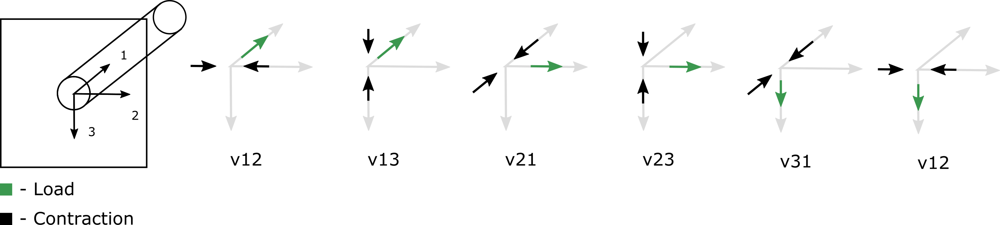

.. _EngineeringConstants:

Engineering Constants
=====================

- :math:`E_{i}=\frac{\sigma_{ii}}{\varepsilon_{ii}}` :
  Youngs modulus along direction *i*.
- :math:`G_{ij}=\frac{\sigma_{ij}}{2\varepsilon_{ij}}` :
  Shear modulus in plane with normal *i* and load in direction *j*.
- :math:`\nu_{ij}=-\frac{\varepsilon_{jj}}{\varepsilon_{ii}}` :
  Poisson's ratio due to load applied in direction *i* and measured response in direction *j*.
  Please note, that some textbooks use different definitions.

with :math:`i, j \in [1, 2, 3]`.

**Implications:**

- :math:`G_{ij} = G_{ji}` due to the symmetry of :math:`\boldsymbol{\sigma}` and :math:`\boldsymbol{\varepsilon}`

**Visualization:**

