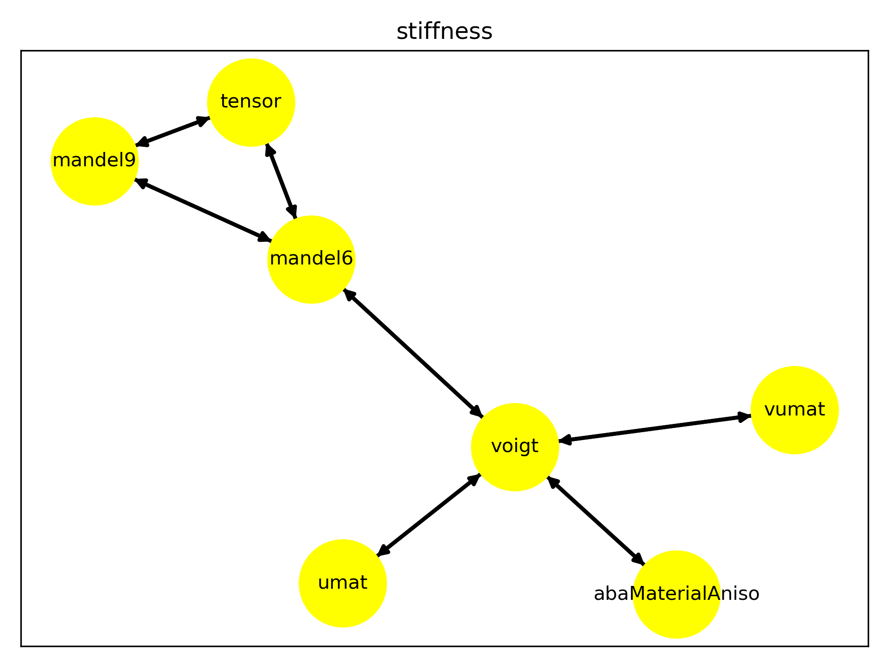

# Summary

The Python package `mechkit` is a toolkit for researchers
in the field of continuum mechanics and material modeling.
`Mechkit` contains methods and operators
that simplify common tasks, especially in the area of tensor algebra and notation.

Deformations and stresses in solids in our three dimensional world are
usually described in the context of engineering applications by second order tensors.

As linear mappings between the observed deformations and possibly causal stresses,
fourth level tensors have a special task in the field of linear elasticity.
Tensors of second- and fourth-order tensors are the primary field of application
for the methods in `mechkit` and are motivated by research in the areas of
linear elasticity
[@Bertram2015], [@Mandel1965], [@Fedorov1968], [@Mehrabadi1990],
[@Cowin1992], [@Rychlewski2000], [@Spencer1970], [@Boehlke2001], [@Brannon2018]
and the description of microstructures of fiber reinforced
composite materials
[@Bauer2021], [@Kanatani1984], [@Advani1987].

The implementations aim at simplicity in use as well as understandable source code
and do not put primary emphasis on performance.
Furthermore the implementations follow, as directly as possible,
the notation and formulation of the formulas in the scientific sources.
A redundant implementation of identical operations based on different
sources is strived for.

# Statement of need

The methods and operators occurring in the field of linear elasticity and material modeling are
comparatively simple and compact.
Due to this simplicity, they are usually implemented independently by each scientist
during the studies or at the beginning of a further scientific education
do not find their way into more general libraries which are common, e.g., in the field of physics.
Apart from didactic advantages, this procedure causes problems for
the exchange of research code and
the reliability of the implementations.

The main goal of the project `mechkit` is the reuse of research code,
to increase the reliability of the research results and
accelerate and simplify further research.

Mechkit is inspired by [@fiberoripy] and the projects of the author of [@meshio].
and is used, besides numerous closed-source projects, in
[@mechmean].

## Motivation by example: Isotropic material and notations

In the overlapping area of theoretical continuum mechanics, experimental
material modeling
and the numerical solution methods for boundary value problems
a multitude of different notations exists.

As an example, consider the description of the mechanical properties of a
homogeneous and isotropic, i.e. direction-independent, material within the framework of the
simplest theory, linear elasticity.
Such a material can be described identically by two scalar material parameters.
However, in the disciplines mentioned above, at least six different material parameters are commonly used
and motivated by different applications and measurement methods.
This results in 15 possible combinations of scalar descriptions of an
isotropic material, which can be combined to a fourth-order tensor.
For the resulting tensor, again different notations exist following
Voigt, Kelvin-Mandel as well as interfaces of open and commercial finite element codes.

Mechkit" allows an easy exchange between the mentioned notations with user-friendly
interfaces and thus helps to avoid errors.

Since the necessary number of translation functions between different notations
increases drastically with increasing number of notations,
translation between all notation might not be practical.
For the case of notations of second- and fourth-order tensors,
the shortest path between source and target notation is determined
in the graph of supported notations, see \autoref{fig:stiffness_graph}.

{ width=20% }

# Acknowledgements

We acknowledge support from

during the genesis of this project.
We acknowledge contributions from Lisa Latussek.

The research documented in this manuscript has been funded by the German Research Foundation (DFG) within the International Research Training Group “Integrated engineering of continuous-discontinuous long fiber-reinforced polymer structures” (GRK 2078/2). The support by the German Research Foundation (DFG) is gratefully acknowledged.

# References